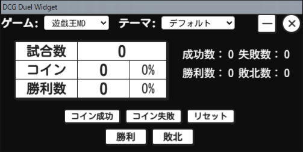
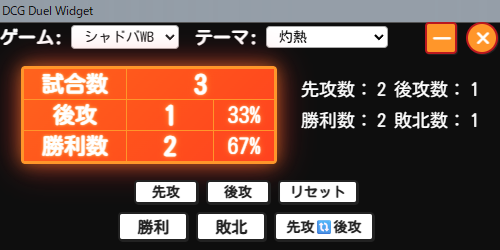
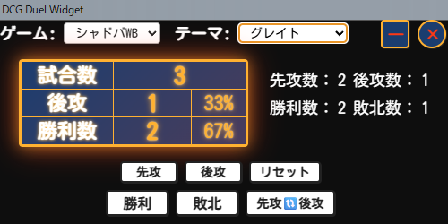
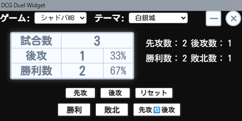

# DCG Duel Widget

デジタルカードゲームの対戦配信用の情報表示ツールです。

---

## 1. 基本画面表示
  
ウィジェットを起動すると、まずこのようなシンプルな画面が表示されます。試合数やコインの成功数・勝利数など、配信中に知りたい情報がひと目で分かります。

---

## 2. 操作説明

### 各ボタンの役割
- **コイン成功**：コイントスが成功したときに押します。コイン成功数が1増え、同時に試合数も1増えます。
- **コイン失敗**：コイントスが失敗したときに押します。コイン失敗数が1増え、同時に試合数も1増えます。
- **リセット**：すべてのカウント（試合数・コイン成功/失敗・勝利/敗北）を0に戻します。
- **勝利**：試合に勝ったときに押します。勝利数が1増え、同時に試合数も1増えます。
- **敗北**：試合に負けたときに押します。敗北数が1増え、同時に試合数も1増えます。

### 数値の意味
- **試合数**：これまでに記録した試合の合計数です。
- **コイン**：コイン成功数と成功率（%）が表示されます。コイン成功率は「コイン成功数 ÷（コイン成功数＋コイン失敗数）」で自動計算されます。
- **勝利数**：勝利数と勝率（%）が表示されます。勝率は「勝利数 ÷ 試合数」で自動計算されます。

### 右側のインジケーターについて
- **成功数・失敗数**：コインの成功・失敗の累計が小さく表示されます。
- **勝利数・敗北数**：勝利・敗北の累計が小さく表示されます。
- これにより、たとえば「試合数が3、コインが1」と表示されている場合、
  - 3試合行い、コイントスに1回成功したということになります。
  - 画像例の場合は3試合して1勝したということになります。
- インジケーターは、配信者自身が集計の内訳を把握するための補助表示です。

---

## 3. 配信ウィジェットとして利用可能

このアプリは、配信ソフト（OBSなど）の「ウィンドウキャプチャ」機能を使って、配信画面上に追加することができます。

また、配信ソフト側でウィジェットの不要な部分をトリミング（切り抜き）して表示することで、
配信視聴者にとって分かりやすい情報だけを簡潔に見せることができます。

---

## 4. 選べるカラーテーマ

---

## 5. ダーク

---

## 6. 綿菓子ピンク

---

## 7. 黒透明

---

## 8. サイバー

---

## 9. 抹茶

---

## 10. チョコ

---

## 11. マリン

---

## 12. 灼熱

---

## 13. グレイト

---

## 14. 白銀城

---

## 15. ピュア

---

## 使い方のポイント
- ボタンを押すだけで、試合数やコイン成功数・勝利数などが自動で集計されます。
- テーマはいつでも切り替え可能。配信の雰囲気に合わせてお楽しみください。

---

