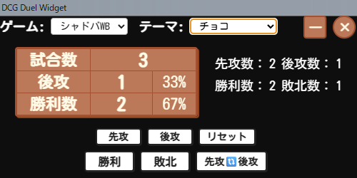
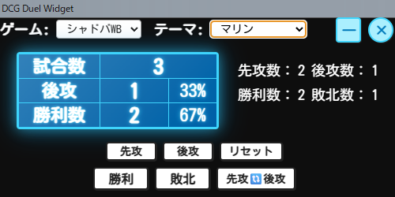

# DCG Duel Widget

デジタルカードゲームの対戦配信用の情報表示ツールです。遊戯王マスターデュエルとシャドウバースWorld Beyondに対応しています。

---

## 0. 🚀 インストール・使用方法

### ダウンロード
1. [Releases](https://github.com/TearTheSky/dcg-duel-widget/releases)から最新版をダウンロード
2. `DCG-Duel-Widget-win32-x64.zip`を解凍
3. `DCG-Duel-Widget.exe`を実行

### 初回起動
1. ゲーム選択で「遊戯王MD」または「シャドバWB」を選択
2. テーマ選択でお好みのカラーテーマを選択
3. 配信ソフトでウィンドウキャプチャを設定

## 1. 基本画面表示

ウィジェットを起動すると、まずこのようなシンプルな画面が表示されます。  
ゲーム選択プルダウンで「遊戯王MD」と「シャドバWB」を切り替えることができ、試合数やコインの成功数・勝利数など、配信中に知りたい情報がひと目で分かります。

---

## 2. 操作説明（遊戯王マスターデュエル）

.png)

遊戯王マスターデュエル用のウィジェットです。コイントスの成功/失敗を記録し、試合数、勝利数、勝率を自動計算します。  
右側の配信者向けのインジケーターで、成功数・失敗数の内訳も確認できます。

### 主な機能
- **コイン成功/失敗**: コイントスの結果を記録
- **試合数**: 総試合数を自動カウント
- **勝利数/敗北数**: 勝敗を記録
- **成功率/勝率**: 自動計算でリアルタイム表示
- **キーボードショートカット**: 
  - `S`: コイン成功/先攻
  - `F`: コイン失敗/後攻
  - `T`: 先攻/後攻切り替え（シャドバのみ）
- **ウィンドウ操作**: 最小化・閉じるボタン

---

## 3. 操作説明（シャドウバースWorld Beyond）

.png)

シャドウバースWorld Beyond用のウィジェットです。先攻/後攻の記録機能があり、「先攻🔃後攻」ボタンでモード切り替えができます。  
もちろん、先攻と後攻を入れ替えても各数値は維持されます。  
右側のインジケーターで、補助情報も提供します。

### 主な機能
- **先攻/後攻**: 先攻と後攻を個別に記録
- **モード切り替え**: 「先攻🔃後攻」ボタンで表示切り替え
- **インジケーター**: 先攻数・後攻数の内訳表示
- **キーボードショートカット**: 
  - `S`: コイン成功/先攻
  - `F`: コイン失敗/後攻
  - `T`: 先攻/後攻切り替え（シャドバのみ）
- **ウィンドウ操作**: 最小化・閉じるボタン

---

## 4-1. 配信ウィジェットとして利用可能（遊戯王MD）

.png)

OBS Studioなどの配信ソフトでウィンドウキャプチャとして利用できます。遊戯王マスターデュエルの配信で、コイントスの成功率や勝率を視聴者に分かりやすく表示できます。

---

## 4-2. 配信ウィジェットとして利用可能（シャドバWB）

.png)

シャドウバースWorld Beyondの配信でも、先攻/後攻の記録や勝率をリアルタイムで表示できます。配信の雰囲気に合わせてテーマを変更することで、より魅力的な配信が可能です。

---

## 5. 選べるたくさんのカラーテーマ

14種類の豊富なカラーテーマから選択できます。配信の雰囲気やゲームの世界観に合わせて、最適なテーマを選ぶことができます。

---

## 6. ダークテーマ

---

## 7. 綿菓子ピンクテーマ

---

## 8. サイバーテーマ

---

## 9. 抹茶テーマ

---

## 10. チョコテーマ

---

## 11. マリンテーマ

---

## 12. 灼熱テーマ

---

## 13. グレイトテーマ

---

## 14. 白銀城テーマ

---

## 15. ピュアテーマ

---

## 16. 伽藍テーマ

---

## 17. ロイヤルテーマ

---

## 🔧 技術仕様

- **プラットフォーム**: Windows
- **フレームワーク**: Electron
- **対応OS**: Windows 10/11
- **ファイルサイズ**: 約200MB

---

## 📝 更新履歴

### v0.2
- シャドウバースWorld Beyond対応
- 14種類のカラーテーマ追加
- キーボードショートカット対応
- 配信用ウィジェット機能強化
- UI/UX改善

### v0.1
- 遊戯王マスターデュエル対応
- 基本機能（コイントス記録、勝率計算）
- シンプルな配信ウィジェット機能

